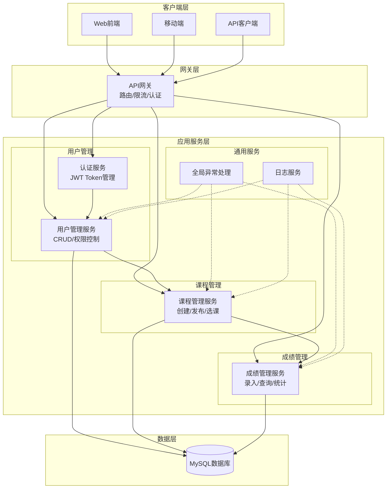

# 学生管理系统技术设计文档

**项目名称：** 学生管理系统（Student Management System, SMS）  
**文档版本：** 2.0  
**作者：** 系统架构师  
**审核人：** 技术总监  
**最后更新日期：** 2025-10-22  
**状态：** 已批准  

---

## 目录

1. [引言](#1-引言)  
   1.1 [编写目的](#11-编写目的)  
   1.2 [项目背景](#12-项目背景)  
   1.3 [文档范围](#13-文档范围)  

2. [系统概述](#2-系统概述)  
   2.1 [系统目标](#21-系统目标)  
   2.2 [系统功能简介](#22-系统功能简介)  
   2.3 [技术选型](#23-技术选型)  
   2.4 [系统架构图](#24-系统架构图)  

3. [接口规范](#3-接口规范)  
   3.1 [协议与格式](#31-协议与格式)  
   3.2 [认证方式](#32-认证方式)  
   3.3 [错误码定义](#33-错误码定义)  
   3.4 [分页规范](#34-分页规范)  

4. [详细模块设计](#4-详细模块设计)  
   4.1 [用户管理模块](#41-用户管理模块)  
   4.2 [课程管理模块](#42-课程管理模块)  
   4.3 [成绩管理模块](#43-成绩管理模块)  

5. [数据模型设计](#5-数据模型设计)  
   5.1 [核心实体说明](#51-核心实体说明)  
   5.2 [数据表结构](#52-数据表结构)  
   5.3 [表间关系](#53-表间关系)  
   5.4 [索引设计](#54-索引设计)  

6. [安全设计](#6-安全设计)  
   6.1 [认证机制](#61-认证机制)  
   6.2 [授权与访问控制](#62-授权与访问控制)  
   6.3 [数据安全](#63-数据安全)  
   6.4 [安全防护措施](#64-安全防护措施)  
   6.5 [安全配置建议](#65-安全配置建议)  

---

## 1. 引言

### 1.1 编写目的

本文档旨在为学生管理系统的开发、测试和运维团队提供完整的技术设计方案，明确系统的功能需求、接口规范、数据模型及安全策略，确保各方对系统设计达成统一认识。

### 1.2 项目背景

为提升高校教学管理效率，需要开发一套学生管理系统，支持学生、教师、管理员三类用户进行用户信息管理、课程安排、成绩录入与查询等数字化操作。系统需具备高可用性、数据一致性及良好的可扩展性。

### 1.3 文档范围

本文档涵盖系统总体架构、接口规范、详细模块设计、数据模型及安全设计。不包含前端UI设计、具体代码实现、容器化部署方案等内容。

---

## 2. 系统概述

### 2.1 系统目标

- **数字化管理**：实现学生、课程、成绩的全流程数字化管理
- **角色分离**：支持学生、教师、管理员三种角色，权限明确分离
- **高性能**：API平均响应时间 < 500ms（P95），支持1000并发用户
- **高可用**：系统月度可用性达到99.9%
- **可扩展**：预留扩展接口，支持未来功能模块接入

### 2.2 系统功能简介

**用户管理**
- 管理员创建、禁用、更新用户
- 用户登录认证与令牌管理
- 基于角色的访问控制（RBAC）

**课程管理**
- 管理员创建、修改、发布课程
- 教师关联授课课程
- 学生查询与选课

**成绩管理**
- 教师录入与更新学生成绩
- 学生查询个人成绩
- 支持按学期、课程筛选

### 2.3 技术选型

| 技术分类 | 选型 | 说明 |
|---------|------|------|
| 后端框架 | Spring Boot 3.x | 简化配置，快速开发 |
| 数据访问 | MyBatis（注解模式） | 灵活的SQL控制 |
| 数据库 | MySQL 8.0 | 成熟稳定的关系型数据库 |
| 安全认证 | Spring Security + JWT | 无状态认证，易扩展 |
| 构建工具 | Maven/Gradle | 依赖管理与构建 |
| 测试框架 | JUnit 5 + Mockito | 单元测试与Mock |

### 2.4 系统架构图



**架构说明：**

**客户端层**
- **Web前端**：基于浏览器的管理界面，支持管理员、教师、学生操作
- **移动端**：移动应用，主要面向学生查询成绩、选课
- **API客户端**：第三方系统集成接口

**网关层**
- **API网关**：统一入口，负责路由转发、请求限流、基础认证
- **功能**：负载均衡、熔断降级、监控统计

**应用服务层**
- **用户管理**：用户认证、权限管理、用户CRUD操作
- **课程管理**：课程创建、发布、选课管理
- **成绩管理**：成绩录入、查询、统计分析
- **通用服务**：异常处理、日志记录

**数据层**
- **MySQL数据库**：统一数据存储，支持事务一致性

**技术特点**
- **单体架构**：服务集中部署，简化运维管理
- **分层解耦**：各层职责明确，降低耦合度
- **统一数据**：单一数据源，保证数据一致性
- **容错设计**：异常处理机制保证系统稳定性

---

## 3. 接口规范

### 3.1 协议与格式

**协议要求**
- 所有接口使用HTTP协议通信
- 基于REST架构风格设计
- 路径格式：`/api/v1/{resource}`
- 资源命名：使用名词复数、小写、连字符分隔

**请求格式**
- Content-Type: `application/json; charset=utf-8`
- 请求体：JSON格式
- 字符编码：UTF-8

**响应格式**
- 统一响应结构：`CommonResponse<T>`
- 分页响应结构：`CommonPageResponse<T>`

**通用请求头**
- `Authorization`: Bearer Token（登录与公开接口除外）
- `Content-Type`: application/json; charset=utf-8
- `X-Request-Id`: 请求追踪ID（可选）
- `X-Trace-Id`：链路追踪ID（可选）

**HTTP方法约定**
- GET：简单查询（参数少、无复杂筛选）
- POST：创建、修改、删除、复杂查询

### 3.2 认证方式

**JWT令牌认证**
- 用户登录成功后返回JWT令牌
- 令牌包含用户ID、用户名、角色等信息
- 令牌有效期：3600秒（1小时）
- 请求头格式：`Authorization: Bearer <jwt-token>`

**认证流程**
1. 用户提交用户名与密码
2. 系统验证通过后生成JWT令牌
3. 客户端在后续请求中携带令牌
4. 服务端验证令牌签名与有效期
5. 根据令牌中的角色信息进行权限控制

### 3.3 错误码定义

**错误码格式**
- 13位字符串：`[4位子系统码][1位类型码][2位保留位][6位业务码]`
- 子系统码：`1001`（学生管理系统）
- 类型码：S（成功）、B（业务错误）、C（客户端错误）、T（技术错误）、U（未知）

**常用错误码**

| 错误码 | 说明 | HTTP状态码 |
|--------|------|-----------|
| 0 | 操作成功 | 200/201 |
| 1001B00000001 | 用户名已存在 | 409 |
| 1001B00000002 | 用户不存在 | 404 |
| 1001B00000003 | 密码错误 | 401 |
| 1001B00000004 | 课程代码已存在 | 409 |
| 1001C00000001 | 参数校验失败 | 400 |
| 1001C00000002 | 未认证 | 401 |
| 1001C00000003 | 权限不足 | 403 |
| 1001T00000001 | 系统内部错误 | 500 |

### 3.4 分页规范

**分页参数**
- `pageNumber`: 页码（从1开始，默认1）
- `pageSize`: 每页数量（默认10，最大100）
- `sortBy`: 排序字段（可选，需白名单校验）
- `order`: 排序方向（asc/desc，默认asc）

**分页响应结构**

| 字段 | 类型 | 说明 |
|------|------|------|
| code | string | 状态码 |
| msg | string | 描述信息 |
| data.total | integer | 总条数 |
| data.pageNumber | integer | 当前页码 |
| data.pageSize | integer | 每页数量 |
| data.list[] | array | 数据列表 |

---

## 4. 详细模块设计

### 4.1 用户管理模块

#### 4.1.1 功能描述

**核心功能**
- 管理员创建、禁用、更新用户账号
- 用户登录认证与令牌颁发
- 基于角色的访问控制（学生、教师、管理员）

**业务规则**
- 用户名全局唯一，长度3-50字符
- 密码需包含大小写字母、数字、特殊字符，长度8-20字符
- 用户角色在创建时确定，后续可由管理员修改
- 用户登录失败5次后锁定15分钟

#### 4.1.2 接口设计

##### 4.1.2.1 创建用户

**请求路径：** `POST /api/v1/users`

**请求参数：**

| 参数名 | 位置 | 类型 | 必填 | 说明 |
|------|------|------|------|------|
| Authorization | Header | string | 是 | Bearer Token（管理员权限） |
| username | Body | string | 是 | 用户名（3-50字符，唯一） |
| password | Body | string | 是 | 密码（8-20字符，含强度要求） |
| role | Body | string | 是 | 角色：student/teacher/admin |

**响应参数：**

| 字段 | 类型 | 说明 |
|------|------|------|
| code | string | 状态码 |
| msg | string | 描述信息 |
| data.id | number | 用户ID |
| data.username | string | 用户名 |
| data.role | string | 角色 |
| data.createTime | string | 创建时间（ISO8601） |

**响应示例：**
```json
{
  "code": "0",
  "msg": "OK",
  "data": {
    "id": 10001,
    "username": "zhangsan",
    "role": "student",
    "createTime": "2025-01-27T10:00:00Z"
  }
}
```

##### 4.1.2.2 获取用户信息

**请求路径：** `GET /api/v1/users/{id}`

**请求参数：**

| 参数名 | 位置 | 类型 | 必填 | 说明 |
|------|------|------|------|------|
| Authorization | Header | string | 是 | Bearer Token |
| id | Path | number | 是 | 用户ID |

**响应参数：**

| 字段 | 类型 | 说明 |
|------|------|------|
| code | string | 状态码 |
| msg | string | 描述信息 |
| data.id | number | 用户ID |
| data.username | string | 用户名 |
| data.role | string | 角色 |
| data.createTime | string | 创建时间 |

**响应示例：**
```json
{
  "code": "0",
  "msg": "OK",
  "data": {
    "id": 10001,
    "username": "zhangsan",
    "role": "student",
    "createTime": "2025-01-27T10:00:00Z"
  }
}
```

##### 4.1.2.3 用户登录

**请求路径：** `POST /api/v1/auth/login`

**请求参数：**

| 参数名 | 位置 | 类型 | 必填 | 说明 |
|------|------|------|------|------|
| username | Body | string | 是 | 登录用户名 |
| password | Body | string | 是 | 登录密码 |

**响应参数：**

| 字段 | 类型 | 说明 |
|------|------|------|
| code | string | 状态码 |
| msg | string | 描述信息 |
| data.token | string | JWT令牌 |
| data.expiresIn | number | 过期秒数 |

**响应示例：**
```json
{
  "code": "0",
  "msg": "OK",
  "data": {
    "token": "eyJhbGciOiJIUzI1NiIsInR5cCI6IkpXVCJ9...",
    "expiresIn": 3600
  }
}
```

##### 4.1.2.4 禁用/启用用户

**请求路径：** `POST /api/v1/users/{id}/status`

**请求参数：**

| 参数名 | 位置 | 类型 | 必填 | 说明 |
|------|------|------|------|------|
| Authorization | Header | string | 是 | Bearer Token（管理员） |
| id | Path | number | 是 | 用户ID |
| enabled | Body | boolean | 是 | 是否启用 |

**响应参数：**

| 字段 | 类型 | 说明 |
|------|------|------|
| code | string | 状态码 |
| msg | string | 描述信息 |
| data.id | number | 用户ID |
| data.enabled | boolean | 是否启用 |

**响应示例：**
```json
{
  "code": "0",
  "msg": "OK",
  "data": {
    "id": 10001,
    "enabled": false
  }
}
```

### 4.2 课程管理模块

#### 4.2.1 功能描述

**核心功能**
- 管理员创建、修改、发布/下线课程
- 教师关联授课课程
- 学生查询可选课程并选课

**业务规则**
- 课程代码全局唯一，格式如"MATH101"
- 课程状态：draft（草稿）、published（已发布）、archived（已归档）
- 学分必须≥1
- 仅已发布课程允许学生选课
- 一名学生对同一课程只能选课一次

#### 4.2.2 接口设计

##### 4.2.2.1 创建课程

**请求路径：** `POST /api/v1/courses`

**请求参数：**

| 参数名 | 位置 | 类型 | 必填 | 说明 |
|------|------|------|------|------|
| Authorization | Header | string | 是 | Bearer Token（管理员） |
| name | Body | string | 是 | 课程名称 |
| code | Body | string | 是 | 课程代码（唯一） |
| teacherId | Body | number | 是 | 授课教师ID |
| credits | Body | integer | 是 | 学分（≥1） |
| semester | Body | string | 是 | 学期（如2025-Spring） |

**响应参数：**

| 字段 | 类型 | 说明 |
|------|------|------|
| code | string | 状态码 |
| msg | string | 描述信息 |
| data.id | number | 课程ID |
| data.name | string | 课程名称 |
| data.code | string | 课程代码 |
| data.teacherId | number | 教师ID |
| data.credits | integer | 学分 |
| data.semester | string | 学期 |
| data.status | string | 状态 |
| data.createTime | string | 创建时间 |

**响应示例：**
```json
{
  "code": "0",
  "msg": "OK",
  "data": {
    "id": 20001,
    "name": "高等数学",
    "code": "MATH101",
    "teacherId": 30001,
    "credits": 4,
    "semester": "2025-Spring",
    "status": "draft",
    "createTime": "2025-01-27T10:00:00Z"
  }
}
```

##### 4.2.2.2 获取课程列表

**请求路径：** `GET /api/v1/courses`

**请求参数：**

| 参数名 | 位置 | 类型 | 必填 | 说明 |
|------|------|------|------|------|
| Authorization | Header | string | 是 | Bearer Token |
| semester | Query | string | 否 | 学期筛选 |
| status | Query | string | 否 | 状态筛选 |
| page | Query | integer | 否 | 页码（默认1） |
| size | Query | integer | 否 | 每页数量（默认10） |

**响应参数：**

| 字段 | 类型 | 说明 |
|------|------|------|
| code | string | 状态码 |
| msg | string | 描述信息 |
| data.total | integer | 总条数 |
| data.pageNumber | integer | 页码 |
| data.pageSize | integer | 每页数量 |
| data.list[] | object | 课程对象数组 |

**响应示例：**
```json
{
  "code": "0",
  "msg": "OK",
  "data": {
    "total": 2,
    "pageNumber": 1,
    "pageSize": 10,
    "list": [
      {
        "id": 20001,
        "name": "高等数学",
        "code": "MATH101",
        "teacherId": 30001,
        "credits": 4,
        "semester": "2025-Spring",
        "status": "published"
      },
      {
        "id": 20002,
        "name": "大学英语",
        "code": "ENG101",
        "teacherId": 30002,
        "credits": 3,
        "semester": "2025-Spring",
        "status": "draft"
      }
    ]
  }
}
```

##### 4.2.2.3 发布/下线课程

**请求路径：** `POST /api/v1/courses/{id}/status`

**请求参数：**

| 参数名 | 位置 | 类型 | 必填 | 说明 |
|------|------|------|------|------|
| Authorization | Header | string | 是 | Bearer Token（管理员） |
| id | Path | number | 是 | 课程ID |
| status | Body | string | 是 | 新状态（draft/published/archived） |

**响应参数：** 同创建课程

**响应示例：**
```json
{
  "code": "0",
  "msg": "OK",
  "data": {
    "id": 20001,
    "name": "高等数学",
    "code": "MATH101",
    "teacherId": 30001,
    "credits": 4,
    "semester": "2025-Spring",
    "status": "published",
    "createTime": "2025-01-27T10:00:00Z"
  }
}
```

##### 4.2.2.4 选课（学生）

**请求路径：** `POST /api/v1/courses/{id}/enroll`

**请求参数：**

| 参数名 | 位置 | 类型 | 必填 | 说明 |
|------|------|------|------|------|
| Authorization | Header | string | 是 | Bearer Token（学生） |
| id | Path | number | 是 | 课程ID |

**响应参数：**

| 字段 | 类型 | 说明 |
|------|------|------|
| code | string | 状态码 |
| msg | string | 描述信息 |
| data.courseId | number | 课程ID |
| data.enrolled | boolean | 选课结果 |

**响应示例：**
```json
{
  "code": "0",
  "msg": "OK",
  "data": {
    "courseId": 20001,
    "enrolled": true
  }
}
```

### 4.3 成绩管理模块

#### 4.3.1 功能描述

**核心功能**
- 教师为所授课程的学生录入与更新成绩
- 学生查询个人课程成绩
- 支持按学期、课程筛选成绩

**业务规则**
- 成绩范围：0.0 ~ 100.0（保留一位小数）
- 一名学生在一门课程中仅有一条成绩记录
- 仅授课教师可录入该课程的成绩
- 成绩录入后记录录入时间
- 成绩可更新与撤销（需记录原因）

#### 4.3.2 接口设计

##### 4.3.2.1 录入/更新成绩

**请求路径：** `POST /api/v1/grades`

**请求参数：**

| 参数名 | 位置 | 类型 | 必填 | 说明 |
|------|------|------|------|------|
| Authorization | Header | string | 是 | Bearer Token（教师） |
| courseId | Body | number | 是 | 课程ID |
| studentId | Body | number | 是 | 学生ID |
| score | Body | number | 是 | 成绩（0.0~100.0） |

**响应参数：**

| 字段 | 类型 | 说明 |
|------|------|------|
| code | string | 状态码 |
| msg | string | 描述信息 |
| data.courseId | number | 课程ID |
| data.studentId | number | 学生ID |
| data.score | number | 成绩 |
| data.recordTime | string | 录入时间 |

**响应示例：**
```json
{
  "code": "0",
  "msg": "OK",
  "data": {
    "courseId": 20001,
    "studentId": 40001,
    "score": 88.5,
    "recordTime": "2025-01-27T10:00:00Z"
  }
}
```

##### 4.3.2.2 查询学生成绩

**请求路径：** `GET /api/v1/grades`

**请求参数：**

| 参数名 | 位置 | 类型 | 必填 | 说明 |
|------|------|------|------|------|
| Authorization | Header | string | 是 | Bearer Token（学生/教师） |
| courseId | Query | number | 否 | 课程ID筛选 |
| semester | Query | string | 否 | 学期筛选 |

**响应参数：**

| 字段 | 类型 | 说明 |
|------|------|------|
| code | string | 状态码 |
| msg | string | 描述信息 |
| data[] | object | 成绩对象数组（GradeEntity） |

**响应示例：**
```json
{
  "code": "0",
  "msg": "OK",
  "data": [
    {
      "id": 50001,
      "courseId": 20001,
      "studentId": 40001,
      "score": 88.5,
      "recordTime": "2025-01-27T10:00:00Z",
      "createTime": "2025-01-27T10:00:00Z",
      "updateTime": "2025-01-27T10:00:00Z"
    }
  ]
}
```

##### 4.3.2.3 成绩撤销/更正

**请求路径：** `POST /api/v1/grades/revoke`

**请求参数：**

| 参数名 | 位置 | 类型 | 必填 | 说明 |
|------|------|------|------|------|
| Authorization | Header | string | 是 | Bearer Token（教师/管理员） |
| courseId | Body | number | 是 | 课程ID |
| studentId | Body | number | 是 | 学生ID |
| reason | Body | string | 是 | 撤销/更正原因 |

**响应参数：**

| 字段 | 类型 | 说明 |
|------|------|------|
| code | string | 状态码 |
| msg | string | 描述信息 |
| data.reverted | boolean | 是否已撤销/更正 |

**响应示例：**
```json
{
  "code": "0",
  "msg": "OK",
  "data": {
    "reverted": true
  }
}
```

---

## 5. 数据模型设计

### 5.1 核心实体说明

系统主要包含以下核心实体：
- **用户（User）**：学生、教师、管理员的统一用户实体
- **课程（Course）**：课程基本信息与状态管理
- **成绩（Grade）**：学生课程成绩记录

**字段命名约定：**
- 表名：小写下划线风格，使用`t_`前缀
- 字段名：小写下划线风格
- 主键：统一使用`id`，类型为`BIGINT AUTO_INCREMENT`
- 审计字段：必须包含`create_time`、`update_time`

### 5.2 数据表结构

#### 5.2.1 用户表 (t_users)

| 字段名 | 类型 | 约束 | 说明 |
|--------|------|------|------|
| id | BIGINT | 主键，自增 | 用户ID |
| username | VARCHAR(50) | NOT NULL, UNIQUE | 用户名 |
| password_hash | TEXT | NOT NULL | 密码哈希 |
| role | ENUM | NOT NULL | 用户角色：student/teacher/admin |
| enabled | TINYINT | NOT NULL, DEFAULT 1 | 是否启用（0禁用，1启用） |
| create_time | TIMESTAMP | NOT NULL, DEFAULT CURRENT_TIMESTAMP | 创建时间 |
| update_time | TIMESTAMP | NOT NULL, ON UPDATE CURRENT_TIMESTAMP | 更新时间 |

#### 5.2.2 课程表 (t_courses)

| 字段名 | 类型 | 约束 | 说明 |
|--------|------|------|------|
| id | BIGINT | 主键，自增 | 课程ID |
| name | VARCHAR(100) | NOT NULL | 课程名称 |
| code | VARCHAR(20) | NOT NULL, UNIQUE | 课程代码 |
| teacher_id | BIGINT | NOT NULL | 授课教师ID（对应t_users.id） |
| credits | INTEGER | NOT NULL, CHECK(>=1) | 学分 |
| semester | VARCHAR(20) | NOT NULL | 开课学期 |
| status | ENUM | NOT NULL, DEFAULT 'draft' | 状态：draft/published/archived |
| create_time | TIMESTAMP | NOT NULL, DEFAULT CURRENT_TIMESTAMP | 创建时间 |
| update_time | TIMESTAMP | NOT NULL, ON UPDATE CURRENT_TIMESTAMP | 更新时间 |

#### 5.2.3 成绩表 (t_grades)

| 字段名 | 类型 | 约束 | 说明 |
|--------|------|------|------|
| id | BIGINT | 主键，自增 | 成绩ID |
| course_id | BIGINT | NOT NULL | 课程ID（对应t_courses.id） |
| student_id | BIGINT | NOT NULL | 学生ID（对应t_users.id） |
| score | DECIMAL(4,1) | NOT NULL, CHECK(0.0~100.0) | 成绩 |
| recorded_at | TIMESTAMP | NOT NULL | 录入时间 |
| create_time | TIMESTAMP | NOT NULL, DEFAULT CURRENT_TIMESTAMP | 创建时间 |
| update_time | TIMESTAMP | NOT NULL, ON UPDATE CURRENT_TIMESTAMP | 更新时间 |

### 5.3 表间关系

| 关系 | 说明 |
|------|------|
| t_users → t_courses | 一对多：一名教师可教授多门课程（通过teacher_id逻辑关联） |
| t_users → t_grades | 一对多：一名学生可拥有多门课程成绩（通过student_id逻辑关联） |
| t_courses → t_grades | 一对多：一门课程可包含多名学生成绩（通过course_id逻辑关联） |

**说明：** 系统不使用数据库外键约束，由应用层维护数据一致性，便于分库分表扩展。

### 5.4 索引设计

#### 5.4.1 用户表 (t_users)

| 索引类型 | 字段 | 说明 |
|---------|------|------|
| 主键索引 | id | 唯一标识 |
| 唯一索引 | username | 加速登录查询，保证唯一性 |
| 普通索引 | role | 加速按角色筛选用户 |

#### 5.4.2 课程表 (t_courses)

| 索引类型 | 字段 | 说明 |
|---------|------|------|
| 主键索引 | id | 唯一标识 |
| 唯一索引 | code | 防止课程代码重复 |
| 普通索引 | teacher_id | 加速查询教师所授课程 |
| 复合索引 | (semester, status) | 按学期和状态筛选课程 |

#### 5.4.3 成绩表 (t_grades)

| 索引类型 | 字段 | 说明 |
|---------|------|------|
| 主键索引 | id | 唯一标识 |
| 唯一约束 | (course_id, student_id) | 确保一名学生在一门课程中仅有一条成绩 |
| 普通索引 | course_id | 加速按课程查询成绩 |
| 普通索引 | student_id | 加速查询学生成绩列表 |

---

## 6. 安全设计

### 6.1 认证机制

#### 6.1.1 JWT 认证流程

1. **登录认证**：用户提交用户名和密码
2. **身份验证**：服务端验证用户名与密码哈希
3. **令牌生成**：验证通过后生成JWT令牌
4. **令牌颁发**：将JWT令牌返回给客户端
5. **请求携带**：客户端在后续请求的`Authorization`头中携带`Bearer <token>`
6. **令牌校验**：服务端解析并验证JWT的签名、有效期和颁发者
7. **权限验证**：根据令牌中的角色信息执行细粒度访问控制

#### 6.1.2 JWT 载荷设计

| 声明（Claim） | 类型 | 示例值 | 说明 |
|--------------|------|--------|------|
| sub | string | "10001" | Subject，用户ID |
| username | string | "zhangsan" | 用户名 |
| role | string | "teacher" | 用户角色 |
| iat | integer | 1737964800 | Issued At，签发时间戳 |
| exp | integer | 1737968400 | Expiration Time，过期时间戳 |

#### 6.1.3 令牌管理

- **有效期**：设置合理过期时间（1小时），降低令牌泄露风险
- **刷新机制**：可选实现Refresh Token机制，用于在JWT过期后获取新令牌
- **存储安全**：
  - Web端：建议使用HttpOnly和Secure的Cookie
  - 移动端：使用安全存储（Keychain/Keystore）
- **令牌撤销**：敏感操作（如禁用用户）需支持令牌黑名单机制

### 6.2 授权与访问控制

#### 6.2.1 角色权限矩阵

权限标识说明：
- 允许：可执行该操作
- 仅本人：仅可操作与本人相关的数据
- 仅所授：仅可操作自己所授课程相关的数据
- 禁止：不可执行该操作

【用户与认证】

| 操作 | 范围/说明 | 学生 | 教师 | 管理员 |
|------|-----------|------|------|--------|
| 用户登录 | 获取JWT | 允许 | 允许 | 允许 |
| 获取用户信息 | 指定用户 | 仅本人 | 仅本人 | 允许 |
| 创建用户 | 系统用户 | 禁止 | 禁止 | 允许 |
| 禁用/启用用户 | 系统用户 | 禁止 | 禁止 | 允许 |

【课程管理】

| 操作 | 范围/说明 | 学生 | 教师 | 管理员 |
|------|-----------|------|------|--------|
| 创建课程 | 新增课程 | 禁止 | 禁止 | 允许 |
| 修改课程 | 基本信息 | 禁止 | 禁止 | 允许 |
| 发布/下线课程 | 状态变更 | 禁止 | 禁止 | 允许 |
| 查询课程列表 | 支持筛选/分页 | 允许 | 允许 | 允许 |

【选课】

| 操作 | 范围/说明 | 学生 | 教师 | 管理员 |
|------|-----------|------|------|--------|
| 选课 | 对已发布课程 | 允许 | 禁止 | 禁止 |
| 退课 | 已选课程 | 允许 | 禁止 | 禁止 |
| 查看课程学生名单 | 指定课程 | 禁止 | 仅所授 | 允许 |

【成绩管理】

| 操作 | 范围/说明 | 学生 | 教师 | 管理员 |
|------|-----------|------|------|--------|
| 录入/更新成绩 | 单课程单学生 | 禁止 | 仅所授 | 允许 |
| 撤销/更正成绩 | 需填写原因 | 禁止 | 仅所授 | 允许 |
| 查询个人成绩 | 登录用户本人 | 允许 | 禁止 | 禁止 |
| 查询课程成绩 | 指定课程 | 禁止 | 仅所授 | 允许 |
| 查询全量成绩 | 全系统 | 禁止 | 禁止 | 允许 |

#### 6.2.2 授权实现

- 在API网关或服务层进行统一的权限校验
- 使用拦截器或装饰器模式，在业务逻辑执行前验证用户角色与操作权限
- 对敏感操作（如删除、修改核心数据）进行二次确认或日志审计
- 遵循最小权限原则，仅授予用户完成任务所需的最低权限

### 6.3 数据安全

#### 6.3.1 密码存储

- 用户密码**绝不以明文存储**
- 使用强哈希算法（如bcrypt、scrypt或Argon2）对密码进行不可逆加密
- 每个用户使用独立的盐值（Salt）进行哈希，防止彩虹表攻击
- 密码强度要求：8-20字符，包含大小写字母、数字和特殊字符

#### 6.3.2 数据传输

- 所有API接口使用**HTTP**协议通信
- 确保网络环境安全可靠
- 敏感数据传输时建议使用HTTPS

#### 6.3.3 敏感数据处理

- 成绩等敏感数据在数据库中不加密存储（因需支持范围查询），通过严格的访问控制保护
- 日志中禁止记录密码、令牌等敏感信息
- API响应不返回密码哈希等敏感字段
- 错误消息不暴露系统实现细节

### 6.4 安全防护措施

#### 6.4.1 防护措施清单

| 威胁类型 | 防护措施 |
|----------|----------|
| SQL注入 | 使用参数化查询或ORM框架，禁止拼接SQL语句 |
| 跨站脚本（XSS） | 对用户输入进行转义和过滤，输出时进行编码 |
| 跨站请求伪造（CSRF） | Web端使用CSRF Token；API优先使用JWT而非Session Cookie |
| 暴力破解 | 登录接口实施失败次数限制（5次失败后锁定15分钟） |
| 接口滥用 | 实施API速率限制（Rate Limiting），如单IP每秒10次请求 |
| 权限绕过 | 服务端严格校验权限，不依赖前端隐藏按钮 |
| 会话劫持 | 使用HTTPS、HttpOnly Cookie、短生命周期令牌 |

#### 6.4.2 安全审计

- **操作日志**：记录关键操作（登录、成绩录入、用户创建），包含操作人、时间、IP地址
- **异常检测**：监控异常登录（如异地登录、频繁失败）
- **定期扫描**：定期进行安全扫描和渗透测试
- **应急响应**：建立安全事件响应机制与流程

### 6.5 安全配置建议

- **最小化权限**：数据库连接用户仅拥有必要表的读写权限
- **环境隔离**：开发、测试、生产环境严格分离，生产环境禁止调试模式
- **依赖管理**：定期更新第三方库，避免使用已知存在漏洞的版本
- **安全头配置**：Web服务配置安全HTTP头：
  - `Content-Security-Policy`: 防XSS
  - `X-Content-Type-Options: nosniff`: 防MIME类型嗅探
  - `X-Frame-Options: DENY`: 防点击劫持
- **密钥管理**：
  - JWT密钥长度≥256位
  - 定期轮换密钥
  - 使用密钥管理服务（KMS）或环境变量存储

---

